# PPS-Unidad3Actividad12-Broken-Authentication

Este contenido corresponde con la actividad 12 de la Unidad de Aprendizaje 3 de Puesta en Producción Segura.

Explotación y Mitigación de Broken Authenticatión.

## Objetivos

- Ver cómo se pueden hacer ataques autenticación.

- Analizar el código de la aplicación que permite ataques de autenticación débil.

- Implementar diferentes modificaciones del codigo para aplicar mitigaciones o soluciones.

---

## ¿Qué es Broken Authentication o Autenticación débil?

Son prácticas de seguridad inadecuadas o insuficientes en los mecanismos que usan los sistemas para verificar la identidad de los usuarios.

Esto significa que un atacante puede acceder a una cuenta sin autorización, comprometiendo de esta manera la confidencialidad e integridad del sistema.

Esto se debe por las siguientes características comunes:

- Uso de contraseñas fáciles de adivinar (como “123456” o “password”).

- No requerir autenticación multifactor (MFA).

- No aplicar restricciones de longitud o complejidad de contraseña.

- Almacenar contraseñas sin cifrado adecuado, como en texto plano.

- Sesiones mal gestionadas, como tokens que no expiran correctamente.

- No proteger contra ataques de fuerza bruta o credenciales reutilizadas.

Como consecuencia de las características anteriores puede suceder: 

- Descubrimiento de credenciales de usuario.

- Ejecución de ataques de suplantación de usuarios. 

---
 
## ACTIVIDADES

- Leer detenidamente [la sección de vulnerabilidades de subida de archivos de la página de PortWigger](https://portswigger.net/web-security/authentication)

- Leer el siguiente [documento sobre Explotación y Mitigación de ataques de Remote Code Execution](./files/ExplotacionYMitigacionBrokenAuthentication.pdf)

- También y como marco de referencia, tenemos [la sección de correspondiente de los Procesos de Registros de Usuarios del  **Proyecto Web Security Testing Guide** (WSTG) del proyecto **OWASP**.](https://owasp.org/www-project-web-security-testing-guide/stable/4-Web_Application_Security_Testing/03-Identity_Management_Testing/02-Test_User_Registration_Process)>

---


### Iniciar entorno de pruebas

-Situáte en la carpeta de del entorno de pruebas de nuestro servidor LAMP e inicia el esce>

```
docker-compose up -d
```

 
### Creación de la Base de Datos
---

Para realizar esta actividad necesitamos acceder a una Base de datos con usuarios y contraseñas. Si ya la has creado en la actividad de Explotación y mitigación de ataques de inyección SQL, no es necesario que la crees de nuevo. Si no la has creado, puedes verlo en <https://github.com/jmmedinac03vjp/PPS-Unidad3Actividad4-InyeccionSQL> en la sección de Creación de Base de datos.

Crea la tabla de usuarios. Debería de mostrarte algó así al acceder a:

```
http://localhost:8080
```

### Instalar **hydra** en tu equipos.

Vamos a realizar un ataque de fuerza bruta para intentar recuperar las contraseñas. Esto lo haremos con el malware **hydra**

Si tu equipo es Linux, puedes instalarlo con:

```
sudo apt install hydra
```

Si tienes Windows puedes descargarlo desde la página del desarrollador: <https://www.incibe.es/servicio-antibotnet/info/Hydra>


### Descargar el diccionario de contraseñas

En nuestro caso como usamos Linux accedemos a:

```
cd /usr/share
wget https://weakpass.com/download/90/rockyou.txt.gz
gunzip rockyou.txt.gz
```

## Código vulnerable


El código contiene varias vulnerabilidades que pueden ser explotadas para realizar ataques de autenticación rota.

Crear al archivo **login_weak.php** con el siguiente contenido (tencuidado de sustituír **mi_password** por la contraseña de root de tu BBDD:

Para conocer la contraseña, en docker-compose-lamp hay un fichero .env en el que aparece la contraseña de root de la BD:

```
<?php
// creamos la conexión 
$conn = new mysqli("database", "root", "MyPassword", "SQLi");

if ($conn->connect_error) {
        // Excepción si nos da error de conexión
        die("Error de conexión: " . $conn->connect_error);
}
if ($_SERVER["REQUEST_METHOD"] == "POST" || $_SERVER["REQUEST_METHOD"] == "GET") {
        // Recogemos los datos pasados
        $username = $_REQUEST["username"];
        $password = $_REQUEST["password"];

        print("Usuario: " . $username . "<br>");
        print("Contraseña: " . $password . "<br>");

        // preparamos la consulta
        $query = "SELECT * FROM usuarios WHERE usuario = '$username' AND contrasenya = '$password'";
        print("Consulta SQL: " . $query . "<br>");

        //realizamos la consulta y recogemos los resultados
        $result = $conn->query($query);
        if ($result->num_rows > 0) {
        echo "Inicio de sesión exitoso";
        } else {
                echo "Usuario o contraseña incorrectos";
        }
}
$conn->close();

?>
<form method="post">
        <input type="text" name="username" placeholder="Usuario">
        <input type="password" name="password" placeholder="Contrasenya">
        <button type="submit">Iniciar Sesión</button>
</form>
```

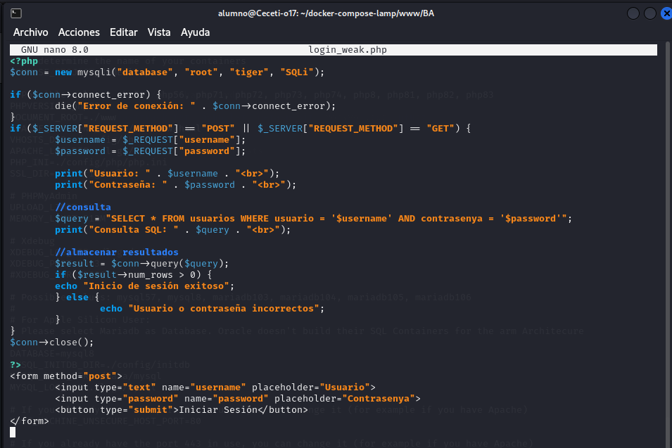

Antes de acceder la página web, asegurarse de que el servicio está en ejecución, y si es necesario, arrancar o reiniciar el servicio.

Acceder a la pagina web aunque también podemos poner directamente el usuario y contraseña. Un ejemplo es  el siguiente enlace:

```
http://localhost/login_weak.php?username=admin&password=123456
```

Vemos que si los datos son incorrectos nos muestra que no lo es:

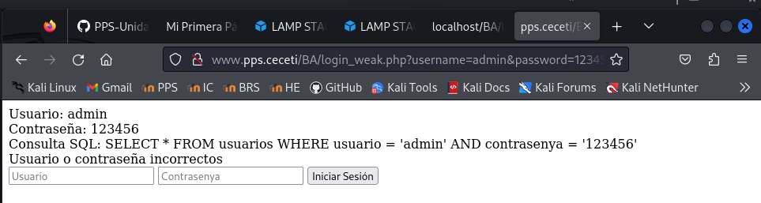

Y si es correcta nos lo indica:

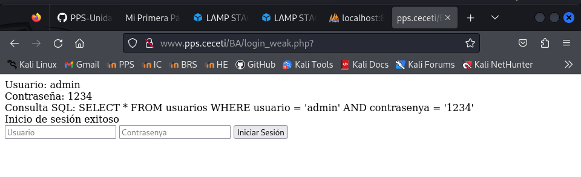


**Vulnerabilidades del código:**

1. Inyección SQL: La consulta SQL usa variables sin validación, lo que permite ataques de inyección.

2. Uso de contraseñas en texto plano: No se usa hashing para almacenar las contraseñas, lo que facilita su robo en caso de acceso a la base de datos.

3. Falta de control de intentos de inicio de sesión: No hay mecanismos de protección contra ataques de fuerza bruta.

4. Falta de gestión segura de sesiones: No se generan tokens de sesión seguros tras un inicio de sesión exitoso.


## Explotación de vulnerabilidades de Autenticación Débil

Si el usuario root de MySQL no tiene una contraseña asignada, estableced una para evitar posibles inconvenientes al trabajar con MySQL.


### Ataque de fuerza bruta con Hydra

Si el sistema no tiene un límite de intentos fallidos, se puede usar Hydra para adivinar contraseñas:

Hydra es un malware de tipo troyano bancario que se enfoca en infectar dispositivos Android para robar credenciales bancarias. Además, proporciona una puerta trasera a los atacantes que permite incluir el dispositivo como parte de una botnet y realizar otras actividades maliciosas.

En esta ocasión vamos a simular ser los atacantes y vamos a hacer un ataque de fuerza bruta con Hydra. Intentaremos acceder con todos los usuarios y las contraseñas incluidas en el diccionario rockyou.txt que hemos descargado anteriormente. 

Recordamos que seremos nosotros los atacantes, por eso desde nuestro equipo anfitrión, donde hemos descargado hydra y el diccionario, ejecutamos:

```
__hydra -l admin -P /usr/share/rockyou.txt localhost http-post-form "/login_weak.php:username=^USER^&password=^PASS^:Usuario o contraseña incorrectos" -V__
```

Explicación de los parámetros:

• -l el usuario con el que vamos a probar el login. 

• http-post-form: Indica que estás atacando un formulario de autenticación con método POST.

• "/login_weak.php:username=^USER^&password=^PASS^:Fallo":

	- /login_weak.php → Ruta de la página de inicio de sesión.

	- username=^USER^&password=^PASS^ → Parámetros que se envían en la solicitud POST. Hydra reemplazará ^USER^ y ^PASS^ con los valores de la lista de usuarios y contraseñas.

	- Fallo → Texto que aparece en la respuesta cuando el inicio de sesión falla. Se puede cambiar por el mensaje real de error que muestra la página cuando una contraseña es incorrecta (por ejemplo, "Usuario o contraseña incorrectos").


Aquí podemos ver cómo lanzamos el comando:

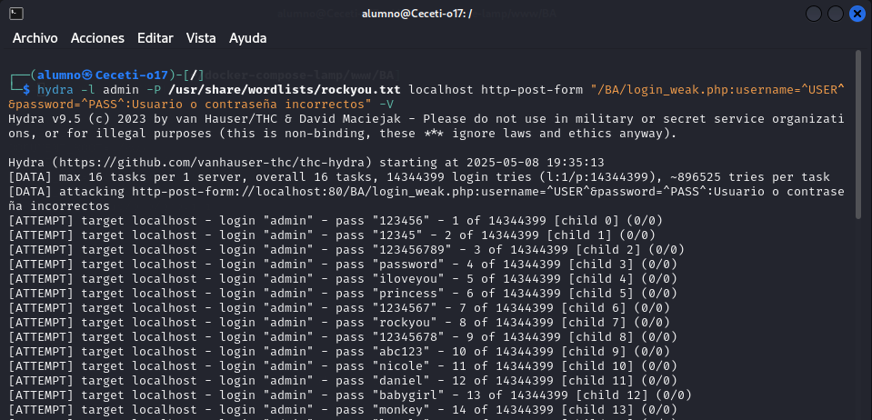

Si encontramos un resultado correcto de autenticación, vemos como nos lo muestra:

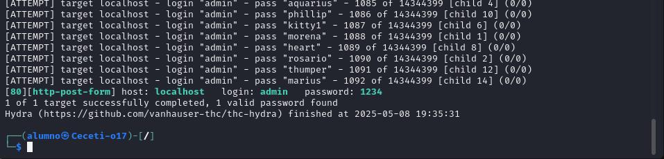


---


## Explotación de SQL Injection

Cómo ya vimos en la actividad de Inyección de SQL, el atacante puede intentar un payload malicioso en el campo de contraseña:

```
username: admin
password: ' OR '1'='1
```

Esto convertiría la consulta en:

```
SELECT * FROM users WHERE username = 'admin' AND password = '' OR '1'='1';
```

Debido a que '1'='1' es siempre verdadero, el atacante obtendría acceso.

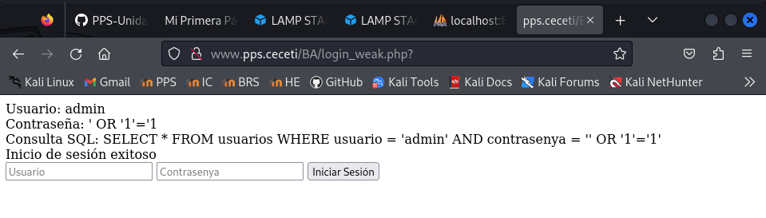


## Mitigación: Código Seguro en PHP

### **Uso de contraseñas cifradas con password_hash**
---

La primera aproximación es no guardar las contraseñas en texto, sino aplicarle encriptación o hash que lo hemos visto ya en los contenidos teóricos.

Para almacenar las contraseñas hasheadas, deberemos de modificar la tabla donde guardamos los usuarios, por lo que tenemos que realizar varias operaciones:

**Modificamos la tabla de contraseñas de la BBDD**

Ejecutamos la consulta sobre la BBDD 

Recuerda que:

- Accedemos al contenedor de la BBDD:

```
 docker exec -it lamp-mysql8 /bin/bash
```

- Nos conectamos a la Base de Datos como usuario root con mysql y despues ejecutar la consulta).

```
 mysql -u root -p
```

- Y seleccionamos la BBDD y modificamos la tabla:

```
 USE SQLi
 ALTER TABLE usuarios MODIFY contrasenya VARCHAR(255) NOT NULL; 
```

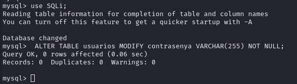


Creamos la función **ạdd_user.php** para introducir los usuarios con su contraseña hasheada (Acuérdate de cambiar MiContraseña por la tuya de root):

```
<?php
error_reporting(E_ALL);
ini_set('display_errors', 1);

// Conexión
$conn = new mysqli("database", "root", "MiContraseña", "SQLi"); 
// ← Usa "localhost" si no estás en Docker
if ($conn->connect_error) {
    die("Conexión fallida: " . $conn->connect_error);
}

if ($_SERVER["REQUEST_METHOD"] == "POST") {
    // Verificamos campos
    if (isset($_POST["username"]) && isset($_POST["password"])) {
        $username = $_POST["username"];
        $password = $_POST["password"];

        // Hasheamos contraseña
        $hashed_password = password_hash($password, PASSWORD_DEFAULT);

        // Insertamos usuario
        $stmt = $conn->prepare("INSERT INTO usuarios (usuario, contrasenya) VALUES (?, ?)");
        if ($stmt === false) {
            die("Error en prepare: " . $conn->error);
        }

        $stmt->bind_param("ss", $username, $hashed_password);

        if ($stmt->execute()) {
            echo " Usuario insertado correctamente.";
        } else {
            echo " Error al insertar usuario: " . $stmt->error;
        }

        $stmt->close();
    } else {
        echo " Por favor, rellena todos los campos.";
    }
}

$conn->close();
?>

<form method="post">
    <input type="text" name="username" placeholder="Usuario" required>
    <input type="password" name="password" placeholder="Contrasenya" required>
    <button type="submit">Crear Usuario</button>
</form>
```

En la función **pasword_hash()"** utilizamos la función por defecto: **PASSWORD_DEFAULT** que usa actualmente **BCRYPT**, pero se actualizará automáticamente en versiones futuras de PHP. Si deseas más control, puedes usar **PASSWORD_BCRYPT** o **PASSWORD_ARGON2ID**.

Como vemos, una vez ejecutado nos informa que el usuario raul con contraseña 123456 ha sido insertado.

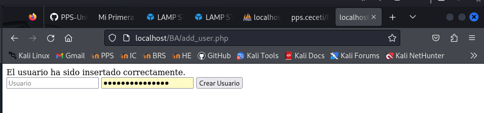

Lo podemos ver accediendo al servicio phpmyadmin: `http://localhost:8080`

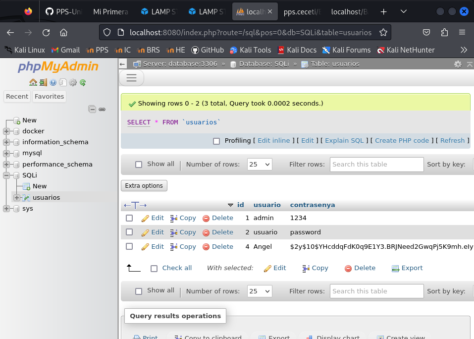

También puedes obtener los usuarios conectandote a la base de datos y ejecutando la consulta:

```
SELECT * from usuarios
```

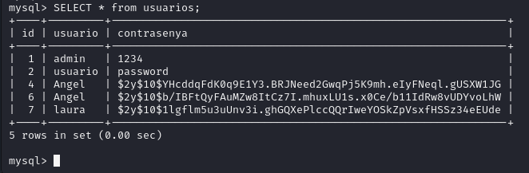

La función **password_hash()** con **PASSWORD_BCRYPT** genera un hash de hasta 60 caracteres, y con
PASSWORD_ARGON2ID, incluso más (hasta 255). Por eso, se necesita que la columna pueda almacenarlos
adecuadamente.

Aplicando mitigaciones de uso de contraseñas con password_hash tendríamos el siguiente archivo: **login_weak1.php**:
(Recuerda que tienes que cambiar miContraseña por tu contraseña de root)

```
<?php
// creamos la conexión 
$conn = new mysqli("database", "root", "MyPassword", "SQLi");

if ($conn->connect_error) {
        // Excepción si nos da error de conexión
        die("Error de conexión: " . $conn->connect_error);
}
if ($_SERVER["REQUEST_METHOD"] == "POST" || $_SERVER["REQUEST_METHOD"] == "GET") {
        // Recogemos los datos pasados
        $username = $_REQUEST["username"];
        $password = $_REQUEST["password"];

        print("Usuario: " . $username . "<br>");
        print("Contraseña: " . $password . "<br>");

        // NO PREVENIMOS SQL INJECTION, SOLO SE AGREGA PASSWORD_HASH
        $query = "SELECT contrasenya FROM usuarios WHERE usuario = '$username'";
        print("Consulta SQL: " . $query . "<br>");

        //realizamos la consulta y recogemos los resultados
        $result = $conn->query($query);
        if ($result->num_rows > 0) {
                $row = $result->fetch_assoc();
                $hashed_password = $row["contrasenya"];
                // Verificación de contraseña hasheada
                if (password_verify($password, $hashed_password)) {
                        echo "Inicio de sesión exitoso";
                } else {
                        echo "Usuario o contraseña incorrectos";
                }
        } else {
                echo "Usuario no encontrado";
        }
}
$conn->close();

?>
<form method="post">
        <input type="text" name="username" placeholder="Usuario">
        <input type="password" name="password" placeholder="Contrasenya">
        <button type="submit">Iniciar Sesión</button>
</form>
```

Como vemos en la siguiente imagen nos da un login exitoso:

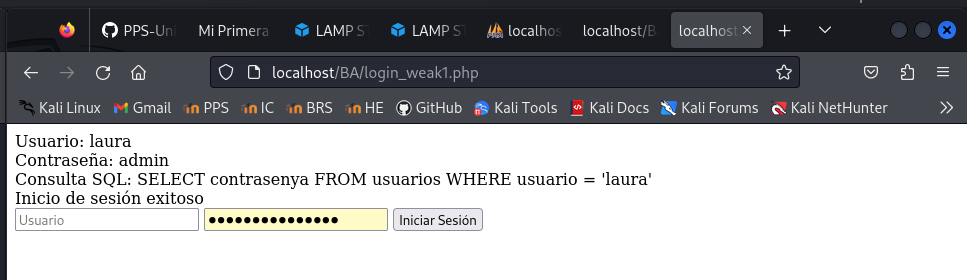


También puedes probar a usuarlos introduciendo en el navegador:

```
http://localhost/login_weak1.php?username=raul&password=123456
```

Si introducimos datos no correcto dará el mensaje de "Usuario o contraseña no correctos"

```
http://localhost/login_weak1.php?username=raul&password=1234
```

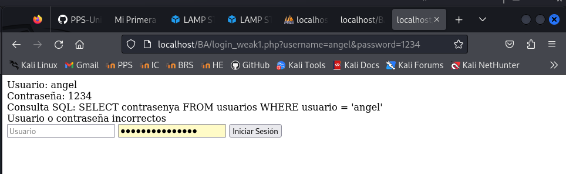


### Uso de consultas preparadas

La siguiente aproximación es usar consultas preparadas, así evitamos ataques de SQL injection.

Creamos el archivo **login_weak2.php** con el siguiente contenido:

```
<?php
// Conexión
$conn = new mysqli("database", "root", "MyPassword", "SQLi");
if ($conn->connect_error) {
    die("Error de conexión: " . $conn->connect_error);
}

// Procesamos petición POST o GET
if ($_SERVER["REQUEST_METHOD"] == "POST" || $_SERVER["REQUEST_METHOD"] == "GET") {
    $username = $_REQUEST["username"];
    $password = $_REQUEST["password"];

    print("Usuario: " . $username . "<br>");
    print("Contraseña: " . $password . "<br>");

    // Consulta segura con prepare + bind
    $query = "SELECT contrasenya FROM usuarios WHERE usuario = ?";
    $stmt = $conn->prepare($query);
    $stmt->bind_param("s", $username);
    $stmt->execute();
    $stmt->store_result();

    print("Consulta SQL (preparada): " . $query . "<br>");

    if ($stmt->num_rows > 0) {
        $stmt->bind_result($hashed_password);
        $stmt->fetch();

        // Comprobamos si la contraseña ingresada coincide con el hash
        if (password_verify($password, $hashed_password)) {
            echo " Inicio de sesión exitoso";
        } else {
            echo " Usuario o contraseña incorrectos";
        }
    } else {
        echo "Usuario no encontrado";
    }

    $stmt->close();
}
$conn->close();
?>

<!-- Formulario -->
<form method="post">
    <input type="text" name="username" placeholder="Usuario">
    <input type="password" name="password" placeholder="Contrasenya">
    <button type="submit">Iniciar Sesión</button>
</form>
```

Como vemos, hemos usado consutas paremetrizadas y además hemos utilizado las funciones para manejar las contraseñas hasheadas:

¿Cómo funciona?

password_hash($password, PASSWORD_DEFAULT) genera una contraseña hasheada segura.0

password_verify($input, $hash_guardado) verifica si la contraseña ingresada coincide con la almacenada.>


### * Implementar bloqueo de cuenta tras varios intentos fallidos
Para bloquear la cuenta después de 3 intentos fallidos, podemos hacer lo siguiente:
1. Añadir un campo failed_attempts en la base de datos para contar los intentos fallidos. 

2. Registrar el timestamp del último intento fallido con un campo last_attempt para poder restablecer los intentos después de un tiempo.

3. Modificar la lógica del login:

	- Si el usuario tiene 3 intentos fallidos, bloquear la cuenta.
	
	- Si han pasado, por ejemplo, 15 minutos desde el último intento, restablecer los intentos fallidos.

	- Si el login es exitoso, reiniciar los intentos fallidos a 0.

**Modificación en la Base de Datos**

Accede a la BBDD como hemos hecho al principio de la actividad y modificala de la siguiente forma: 

```
USE SQLi
ALTER TABLE usuarios ADD failed_attempts INT DEFAULT 0;
ALTER TABLE usuarios ADD last_attempt TIMESTAMP NULL DEFAULT NULL;
```

Vemos como se han añadido las columnas indicadas:

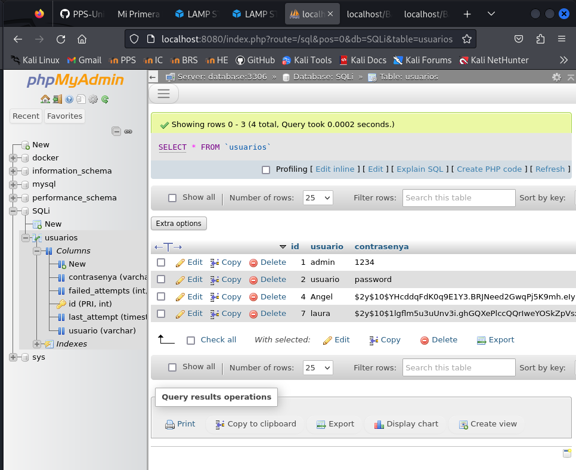
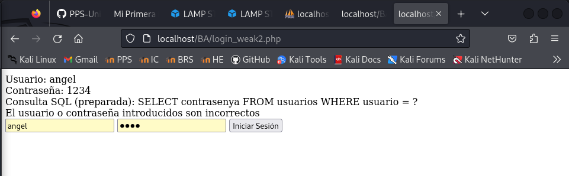

**Código seguro**

Crea el ficher **login_weak3.php** con el siguiete contenido (recuerda cambiar la contraseña):

```
<?php
// Conexión
$conn = new mysqli("database", "root", "MyPassword", "SQLi");
if ($conn->connect_error) {
    die("Error de conexión: " . $conn->connect_error);
}

// Procesamos petición
if ($_SERVER["REQUEST_METHOD"] == "POST" || $_SERVER["REQUEST_METHOD"] == "GET") {
    $username = $_REQUEST["username"];
    $password = $_REQUEST["password"];

    print("Usuario: " . $username . "<br>");
    print("Contraseña: " . $password . "<br>");

    // Obtenemos datos del usuario
    $query = "SELECT contrasenya, failed_attempts, last_attempt FROM usuarios WHERE usuario = ?";
    $stmt = $conn->prepare($query);
    $stmt->bind_param("s", $username);
    $stmt->execute();
    $stmt->store_result();

    if ($stmt->num_rows > 0) {
        $stmt->bind_result($hashed_password, $failed_attempts, $last_attempt);
        $stmt->fetch();

        $current_time = new DateTime();
        $is_blocked = false;

        // Si la cuenta está bloqueada (3 intentos fallidos)
        if ($failed_attempts >= 3 && $last_attempt !== null) {
            $last_attempt_time = new DateTime($last_attempt);
            $interval = $current_time->getTimestamp() - $last_attempt_time->getTimestamp();

            if ($interval < 900) { // Menos de 15 minutos
                $remaining = 900 - $interval;
                $minutes = floor($remaining / 60);
                $seconds = $remaining % 60;
                echo "Cuenta bloqueada. Intenta nuevamente en {$minutes} minutos y {$seconds} segundos.";
                $is_blocked = true;
            }
        }

        if (!$is_blocked) {
            // Verificamos contraseña
            if (password_verify($password, $hashed_password)) {
                echo "Inicio de sesión exitoso";

                // Reiniciar intentos fallidos
                $reset_query = "UPDATE usuarios SET failed_attempts = 0, last_attempt = NULL WHERE usuario = ?";
                $reset_stmt = $conn->prepare($reset_query);
                $reset_stmt->bind_param("s", $username);
                $reset_stmt->execute();
                $reset_stmt->close();
            } else {
                // Incrementar intentos
                $failed_attempts++;
                echo "Usuario o contraseña incorrectos (Intento $failed_attempts de 3)";

                $update_query = "UPDATE usuarios SET failed_attempts = ?, last_attempt = NOW() WHERE usuario = ?";
                $update_stmt = $conn->prepare($update_query);
                $update_stmt->bind_param("is", $failed_attempts, $username);
                $update_stmt->execute();
                $update_stmt->close();
            }
        }
    } else {
        echo "Usuario no encontrado";
    }

    $stmt->close();
}
$conn->close();
?>

<!-- Formulario -->
<form method="post">
    <input type="text" name="username" placeholder="Usuario">
    <input type="password" name="password" placeholder="Contrasenya">
    <button type="submit">Iniciar Sesión</button>
</form>
```


 Qué hace este código:

- Si el usuario tiene 3 fallos y han pasado menos de 15 minutos, la cuenta se bloquea temporalmente.

- Si han pasado más de 15 minutos, los intentos se reinician automáticamente.

- Si el login es exitoso, se ponen los intentos a cero y se borra el last_attempt.

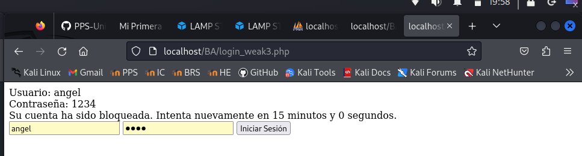

### Implementar autenticación multifactor (MFA)

Para añadir MFA (Autenticación Multifactor) al sistema de login, seguiremos estos pasos:


Pasos para Implementar MFA

1. Generar un código de verificación temporal (OTP) de 6 dígitos.

2. Enviar el código OTP al usuario mediante correo electrónico o SMS (en este caso, usaremos correo simulado con una archivo PHP.

3. Crear un formulario para que el usuario ingrese el código OTP después de iniciar sesión.

4. Verificar el código OTP antes de permitir el acceso.

¿Qué vamos a crear?

- Modificaciones en la base de datos:

	- Campos mfa_code (VARCHAR) y mfa_expires (DATETIME).

- Flujo dividido en dos archivos:

	- login_weak4.php: usuario y contraseña → si correctos, se genera el MFA.


	- verificar_mfa.php: el usuario introduce el código que se le muestra.

	- mostrar_codigo.php: archivo que muestra el código generado.


**1. Modificación en la Base de Datos**

Accede a la BBDD como hemos hecho al principio de la actividad y modificala de la siguiente forma: 

```
USE SQLi
ALTER TABLE usuarios ADD failed_attempts INT DEFAULT 0;
ALTER TABLE usuarios ADD last_attempt TIMESTAMP NULL DEFAULT NULL;
```

**2. login_weak4.php (login + generación del código)**

Crea el archivo login_weak4.php con el siguiente contenido (recuerda cambiar la contraseña):

```
<?php
$conn = new mysqli("database", "root", "MyPassword", "SQLi");
if ($conn->connect_error) {
    die("Error de conexión: " . $conn->connect_error);
}

session_start();

if ($_SERVER["REQUEST_METHOD"] == "POST") {
    $username = $_POST["username"];
    $password = $_POST["password"];

    $query = "SELECT contrasenya FROM usuarios WHERE usuario = ?";
    $stmt = $conn->prepare($query);
    $stmt->bind_param("s", $username);
    $stmt->execute();
    $stmt->store_result();

    if ($stmt->num_rows > 0) {
        $stmt->bind_result($hashed_password);
        $stmt->fetch();

        if (password_verify($password, $hashed_password)) {
            // Login correcto - generar MFA
            $mfa_code = strval(rand(100000, 999999));
            $expires = (new DateTime('+5 minutes'))->format('Y-m-d H:i:s');

            // Guardar código MFA
            $update = $conn->prepare("UPDATE usuarios SET mfa_code = ?, mfa_expires = ? WHERE usuario = ?");
            $update->bind_param("sss", $mfa_code, $expires, $username);
            $update->execute();

            // Guardar usuario en sesión para MFA
            $_SESSION["mfa_user"] = $username;

            // Redirigir a mostrar el código y luego a verificación
            header("Location: mostrar_codigo.php?code=$mfa_code");
            exit();
        } else {
            echo "Contraseña incorrecta.";
        }
    } else {
        echo " Usuario no encontrado.";
    }
    $stmt->close();
}
$conn->close();
?>

<form method="post">
    <input type="text" name="username" placeholder="Usuario" required>
    <input type="password" name="password" placeholder="Contraseña" required>
    <button type="submit">Iniciar sesión</button>
</form>
```

**3. mostrar_codigo.php**

Creamos el archivo **mostrar_codigo.php** con el que visualizaremos el código enviado. Esto simula el ver el código en el email. 

```
<?php
$code = $_GET["code"] ?? "XXXXXX";
echo "<h2>Tu código MFA es: <strong>$code</strong></h2>";
echo "<a href='verificar_mfa.php'>Ir a verificación MFA</a>";
?>
```


**4. verificar_mfa.php (verificación del código)**

Creamos el archivo **verificar_mfa.php** que nos indicará si el código introducido es correcto (recuerda cambiar la contraseña).

```
<?php
session_start();
$conn = new mysqli("database", "root", "MyPassword", "SQLi");
if ($conn->connect_error) {
    die("Error de conexión: " . $conn->connect_error);
}

if (!isset($_SESSION["mfa_user"])) {
    die(" No hay sesión activa para MFA.");
}

$username = $_SESSION["mfa_user"];

if ($_SERVER["REQUEST_METHOD"] == "POST") {
    $code_input = $_POST["mfa_code"];

    $query = "SELECT mfa_code, mfa_expires FROM usuarios WHERE usuario = ?";
    $stmt = $conn->prepare($query);
    $stmt->bind_param("s", $username);
    $stmt->execute();
    $stmt->bind_result($mfa_code, $mfa_expires);
    $stmt->fetch();

    $now = new DateTime();
    $expires_time = new DateTime($mfa_expires);

    if ($code_input === $mfa_code && $now < $expires_time) {
        echo "Autenticación multifactor exitosa. Bienvenido, $username.";

        // Limpieza del código MFA
        $clear = $conn->prepare("UPDATE usuarios SET mfa_code = NULL, mfa_expires = NULL WHERE usuario = ?");
        $clear->bind_param("s", $username);
        $clear->execute();

        session_destroy(); // o puedes mantener sesión como autenticado
    } else {
        echo "Código incorrecto o expirado.";
    }
    $stmt->close();
}
$conn->close();
?>

<form method="post">
    <input type="text" name="mfa_code" placeholder="Código MFA" required>
    <button type="submit">Verificar Código</button>
</form>
```


Flujo de prueba

- En login.php, introduces usuario y contraseña.

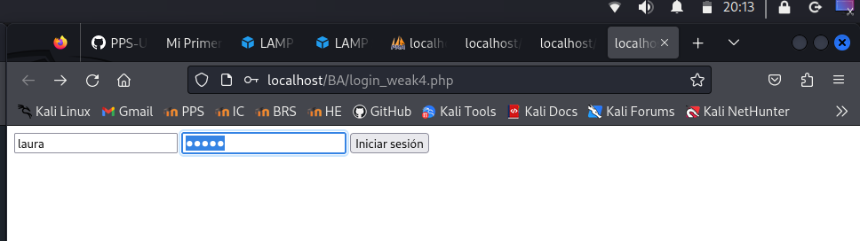

- Si están bien, se genera un código y vas a mostrar_codigo.php.

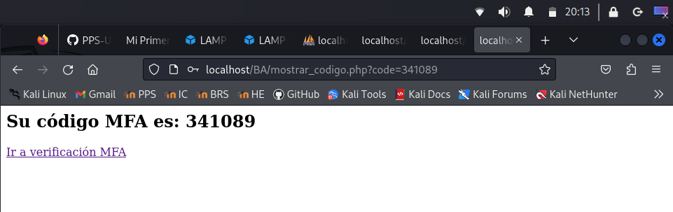

- Desde ahí, clicas a verificar_mfa.php e introduces el código.

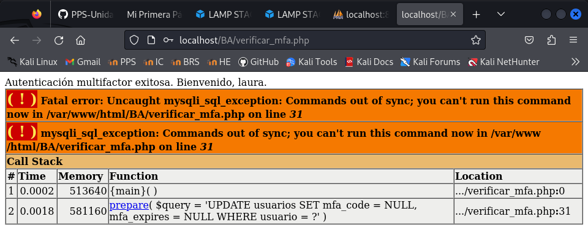


Flujo completo del Login con MFA

1. Usuario ingresa su usuario y contraseña.

2. Si las credenciales son correctas, se genera un código OTP y se guarda en la BD.

3. Se envía el código OTP al usuario por correo electrónico (fichero emails_simulados.txt).

4. Usuario ingresa el código OTP en un formulario.

5. El sistema verifica si el código es válido y no ha expirado.

6. Si es correcto, el usuario accede; si no, se muestra un error.


Beneficios de este Sistema MFA

- Mayor seguridad contra accesos no autorizados.

- Protege contra ataques de fuerza bruta, incluso si la contraseña es robada.

- Fácil de extender a SMS o aplicaciones como Google Authenticator.


> Ángel Pérez Blanco
